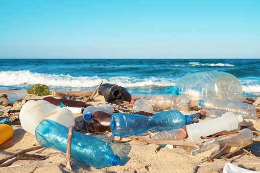
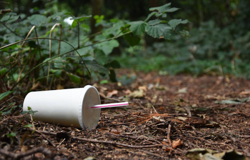
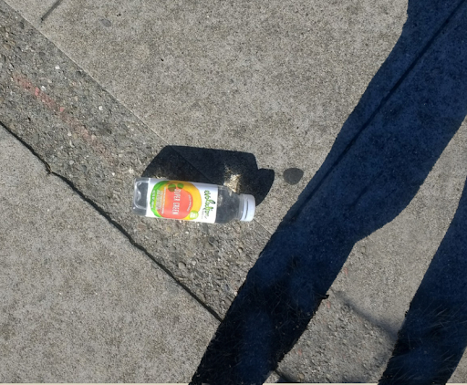
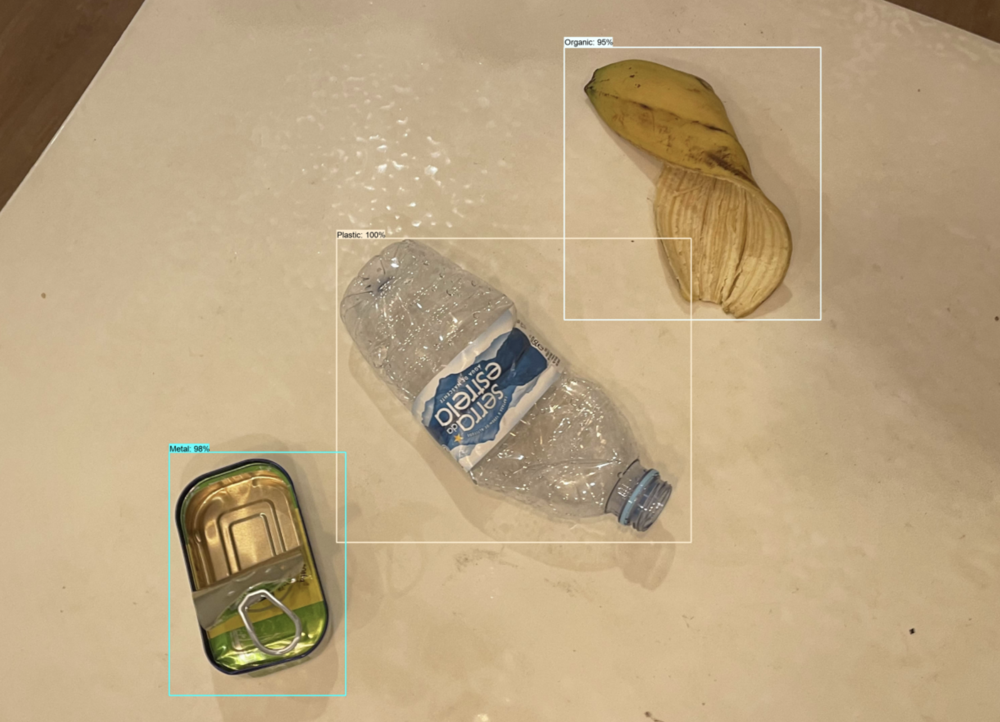

# 🤔 Problem

**2.01 billion tonnes** of municipal solid waste is generated annually in the world.

That's equivalent to **~11.000.000 Boeing 747-400** worth of waste generated by civilization every year.

It is forecasted to grow **+70% by 2050**.

*Source: World Bank*

  
  
  

 

# 💡 Solution

Wall-E detects trash on a live video feed and automatically classifies it among
7 main recycling categories:
- paper
- plastic
- metal
- glass
- organic
- e-waste
- non-recyclable

 

  
  

 

# 🤖 Stack overview

Languages: Python & JavaScript (React)

[Roboflow](https://roboflow.com/) and `fiftyone` library for image annotations and format conversion.

Tensorflow Object Detection API for modeling.

Tensorflow JS & React for deployment to production.

Link to the React app repo: https://github.com/AmElmo/trash_detector_wall-e_production

 

# ✨ Performance metrics

-> Table with Precision + Recall for each training

-> Link to WandB dashboards

| Model        | Batch Size |  Average Speed (ms)  | mAP (Mean Average Precision) | AR (Average Recall) | Link to metrics |
| ------------- |:-------------:| -----:| -----:|-----:|-----:|
| SSD MobileNet V2 FPNLite 320x320      | 32 | 22 | 52.99% | 48.42% | https://wandb.ai/amelmo/Trash-Detector-Wall-E/runs/2qv9wgqn/tensorboard |
| EfficientDet D0 512x512     | 32   |   39 | 54.75% | 48.56% | https://wandb.ai/amelmo/Trash-Detector-Wall-E/runs/2l5hg8gf/tensorboard |
| SSD Resnet50 V1 fpn 640x640 | 32      |  46 | 52.77% | 48.37% | https://wandb.ai/amelmo/Trash-Detector-Wall-E/runs/39dci9bw/tensorboard |

See Weights & Biases dashboards: https://wandb.ai/amelmo/Trash-Detector-Wall-E

**Conclusion** 👉 The EfficientDet D0 model seems to provide the best performance (both mAP and AR) but only slightly better than the faster model SSD Mobilenet V2 FPNLite. Considering the latter is nearly twice as fast and provides almost the same performance, we will use this one in production.

 

# 🪜 Project steps

## 1. 💽 Data collection

Datasets used :
- TACO: https://github.com/pedropro/TACO
- Drinking Waste Dataset: https://www.kaggle.com/datasets/arkadiyhacks/drinking-waste-classification
- Fruit Detection: https://www.kaggle.com/datasets/andrewmvd/fruit-detection
- Fruit Images for Object Detection: https://www.kaggle.com/datasets/mbkinaci/fruit-images-for-object-detection
- Mobile Images Dataset: https://www.kaggle.com/datasets/amirhamzahaq/mobile-images-dataset
- Garbage Classification: https://www.kaggle.com/datasets/asdasdasasdas/garbage-classification (added custom annotations for cardboard & paper categories)
- Open Images Dataset V.6: https://storage.googleapis.com/openimages/web/index.html (used for E-Waste)

A complete list of potential datasets considered: https://github.com/AgaMiko/waste-datasets-review

 

## 2. 🧹 Data cleaning, merging & preprocessing

The 2 datasets used did not have the same split of categories. We combined them to form 7 unique categories commonly used for recycling purposes:
1. Paper
2. Plastic
3. Glass
4. Metal
5. Organic
6. E-Waste
7. Non-recyclable

Step 1: change annotations of TACO dataset to reduce from 60 categories to 7 categories

Step 2: match the 4 categories of the Drinking_Waste_Classification dataset to match our 7 categories

Step 3: combine all annotations into one COCO format annotation

Total number of images: 9478
Total number of annotations: 13854

 

## 3. ✨ Model selection & training

We use Transfer Learning through the Tensorflow Object Detection API. We've selected the following models:
- SSD MobileNet V2 FPNLite 320x320
- EfficientDet D0 512x512

The main reasons for choosing those models:
  1. Their speed (< 40ms for inference) as we need to run predictions on a video feed (hence make ~30 predictions / second). Speed is critical.
  2. Their performance level in relation to their speed ()

 

## 4. 📸 Test predictions on photos

We test our models on a bunch of pictures first before testing on a video feed. See model_and_training notebook, step 12.

 

## 5. 🚲 Lifecycle setup

We use Weights & Biases to keep track of our training metrics. We dump the Tensorflow files after training using the WandB API.

You can see all the public metrics here 👉 https://wandb.ai/amelmo/Trash-Detector-Wall-E

 

## 6. 🌟 Deployment to JavaScript app

We then deploy our model in a React App using Tensorflow JS.

There are a few key steps:

1. Convert the trained model to Tensorflow JS (script in the modelling notebook)
2. Host the model on Google Cloud Storage
3. Ensure CORS configuration is setup so we can access the model in the bucket from our Javascript app
4. Use React.JS to build the front-end application (we used an existing boilerplate for that)
5. Load the graph model from URL
6. Update the Javascript code as to match the labelmap of the model
7. Make detection with the webcam! ✨
8. Push to production (Docker + Google Cloud Run???)

🔗 Dedicated repository for production: https://github.com/AmElmo/trash_detector_wall-e_production

 
